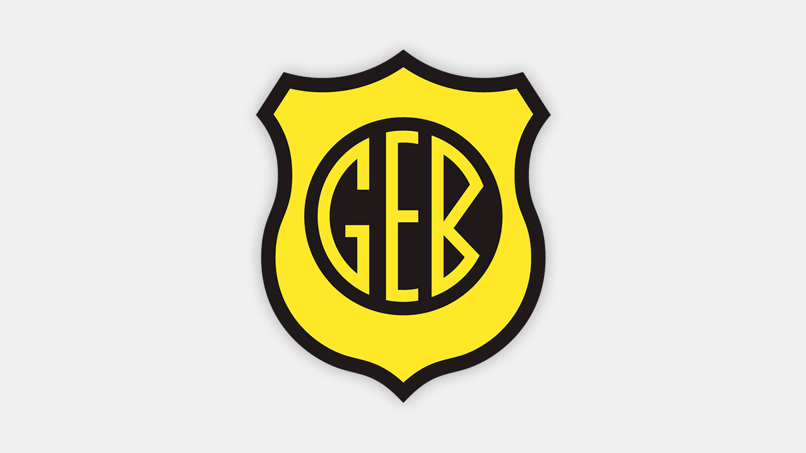

<p align="center">
  </img>
</p>
<h1 align="center">Grêmio Esportivo Bagé</h1>
<p align="center">Projeto <strong>Site Esportivo</strong> desenvolvido durante a Quarentena</p>


## Rodar projeto:

```
npm install
nodemon index.js
```

### PostgreSQL:

<ul>
  <li>Criar DB com o nome de 'bage'</li>
  <li>Ajustar configs no arquivo 'knexfile.js'</li>
</ul>

### Criar migrate:

```
knex migrate:make nome_da_migrate
```

### Rodar migrate:

```
knex migrate:latest
```